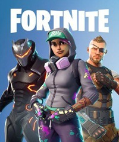
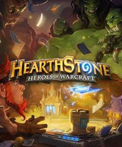
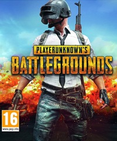
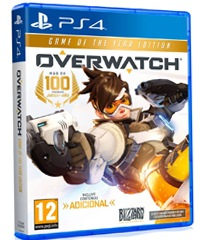

<!DOCTYPE HTML>
<html lang="es">
<head>
	<title>TOPSDGOS</title>
	<meta charset="UFT-8">
	<meta name="viewport" content="width=device-width, inicial-scale=1">
	<link rel="stylesheet"  href="css/bootstrap.min.css">
	
	
		
	<link rel="" HREF="favicon.ico">
	<link rel="stylesheet" href="css/estilos.css">

</head>
<body id="top" data-spy="croll" data-target=".navbar" data-offset="60">
	<header>
<!--nav-->
	<nav class="navegacion">
		<ul class="menu">
			<li><a href="file:///C:/Users/dydda/OneDrive/Documents/hab%20laboral%20software/topsdgos/topsdgos.html">sobre nosotros</a></li>
			<li><a href="">requisitos PC</a></li>
			<li><a href="file:///C:/Users/dydda/OneDrive/Documents/hab%20laboral%20software/topsdgos/LosJuegosMásPopularesde2020.html">tops</a>
			</li>
			<li><a href="">juegos</a></li>
		</ul>
	</nav>
	</header>
<h1 class="boli">Los juegos mas famosos del 2020</h1>

Estos son los juegos más populares de 2020 teniendo el cuenta el número de jugadores activos.
 Conoce los 10 juegos más jugados del mundo según los datos de los servidores de cada videojuego.

 
 
 
Nos hemos centrado en todo tipo de videojuegos; juegos gratis, arcade, estrategia… así como los mejores juegos online de todas las plataformas del mundo (PC, PS4, Xbox, Android, Nintendo Switch) ​  Además de un breve pero conciso análisis de los juegos mas populares, encontrarás las mejores ofertas que hemos podido encontrar de los juegos más jugados actualizados automáticamente por Amazon, por si quieres comprar algún juego al mejor precio.

Para que te sea más fácil ver todas las características de los juegos más jugados, aquí tienes una tabla comparativa interactiva. Haz clic en las pestañas superiores para colocar la tabla a tu gusto.

    

<table>
	<tr>

    <th scope="row">juego</th>

    <th>Jugadores</th>

    <th>Lanzamiento</th>
	
	<th>Precio</th>

	</tr>

  <tr>

    <th>League of Legends </th>

    <td>98 Millones</td>

    <td>2009</td>

    <td>Gratis</td>

  </tr>

  <tr>

    <th>Fortnite </th>

    <td>85 Millones</td>

    <td>2017</td>

    <td>gratis</td>
	
  </tr>

  <tr>

    <th>Counter strike </th>

    <td>46 Millones</td>

    <td>2012</td>

    <td>Gratis</td>

  </tr>
  <tr>
	<th>Hearthstone </th>
	<td>39 Millones</td>
	<td>2014</td>
	<td>Gratis</td>
  </tr>
    <tr>
	<th>Minecraft </th>
	<td>92 Millones</td>
	<td>2011</td>
	<td>26,99 euros</td>
  </tr>
    <tr>
	<th>PUBG </th>
	<td>72 Millones</td>
	<td>2017</td>
	<td>US$29.99</td>
  </tr>
    <tr>
	<th>World of warcraft </th>
	<td>36 Millones</td>
	<td>2004</td>
	<td>12,99€</td>
  </tr>
    <tr>
	<th>OverWatch </th>
	<td>30 Millones</td>
	<td>2016</td>
	<td>24,99 €</td>
  </tr>
    <tr>
	<th>Tom Clancy’s Rainbow Six </th>
	<td>28 Millones</td>
	<td>2015</td>
	<td>$ 39,95</td>
  </tr>
    <tr>
	<th>Grand Theft Auto 5 </th>
	<td>25 Millones</td>
	<td>2013</td>
	<td>25,27 €</td>
  </tr>

</table>
    

	
			<h1 class="loli"><a id="gta5">10 – Grand Theft Auto 5</a></h1>
		

		
Los padres y detractores de la violencia de todo el mundo entran en cólera cuando escuchan su nombre.

		
Grand Theft Auto es un videojuego de acción y aventura de mundo abierto desarrollado en 2013 por Rockstar North, que permite a los jugadores deambular con total libertad por San Andreas en California y la ciudad ficticia de Los Santos.

		
Conocemos la historia criminal de Michael, Franklin y Trevor y sus esfuerzos por cometer atracos mientras están bajo la presión de una agencia gubernamental.

		
Además del modo historia, cuenta con un gigantesco modo Online en el que nos podemos crear un personaje y lanzarnos a los Santos para participar en todo tipo de retos como carreras, partidos de tenis o enfrentamientos entre bandas.

		
El GTA V es un clásico entre los jugadores más experimentados y, gracias a las continuas mejoras de Rockstar, se ha convertido en uno de los juegos online mas populares del mundo.

		 <!--pros y contras-->
		

    <figure class="wp-block-table">
      <table class="has-subtle-pale-green-background-color has-background">
      <thead>
        <tr>
        <th class="has-text-align-center" data-align="center">PROS</th>
        </tr>
      </thead>
     <tbody>
     <tr>
     <td class="has-text-align-center" data-align="center">+ Buen argumento</td>
     </tr>
     <tr>
     <td class="has-text-align-center" data-align="center">+ Variedad de personajes</td>
     </tr>
     <tr>
       <td class="has-text-align-center" data-align="center">+ Libertad de acción</td>
     </tr>
     <tr>
       <td class="has-text-align-center" data-align="center">+ Mejoras visuales</td>
     </tr>
    </tbody>
   </table>
  </figure>
  

   
  

  <figure class="wp-block-table">
  <table class="has-subtle-pale-pink-background-color has-background">
  <thead>
  <tr>
    <th class="has-text-align-center" data-align="center">
    <strong>CONTRAS</strong>
    </th>
    </tr>
    <tbody>
      <tr>
        <td class="has-text-align-center" data-align="center">– Control en primera persona difícil</td>
      </tr>
      <tr>
        <td class="has-text-align-center" data-align="center">– Hay elementos no subtitulados</td>
      </tr>
      <tr>
        <td class="has-text-align-center" data-align="center">– No llega a 60 fps</td>
      </tr>
    </tbody>
   </table>
  </figure>
 

    

			<h1 class="loli"><a id="gta5">9 – Tom Clancy’s Rainbow Six: Siege</a></h1>
		

		
El Rainbow Six Siege es un shooter táctico desarrollado por Ubisoft en 2015. A grandes rasgos, presenta tres modos de juego: Situaciones, Caza al Terrorista y modo Multijugador.

		
Pone gran énfasis en la destrucción del medio ambiente y la cooperación entre jugadores. Estos asumen el control de un atacante o un defensor en el rescate de rehenes y la desactivación de bombas.

		
El multijugador es el clásico modo PVP en el que dos equipos formados por cinco jugadores compiten por la supremacía, siendo este modo la principal razón por la que es uno de los juegos más populares del momento.

			 <!--pros y contras-->
		

    <figure class="wp-block-table">
      <table class="has-subtle-pale-green-background-color has-background">
      <thead>
        <tr>
        <th class="has-text-align-center" data-align="center">PROS</th>
        </tr>
      </thead>
     <tbody>
     <tr>
     <td class="has-text-align-center" data-align="center">+ La tensión de cada partida</td>
     </tr>
     <tr>
     <td class="has-text-align-center" data-align="center">+ Destrucción de los escenarios</td>
     </tr>
     <tr>
       <td class="has-text-align-center" data-align="center">+ Tiene mucho potencial</td>
     </tr>
    </tbody>
   </table>
  </figure>
  

   
  

  <figure class="wp-block-table">
  <table class="has-subtle-pale-pink-background-color has-background">
  <thead>
  <tr>
    <th class="has-text-align-center" data-align="center">
    <strong>CONTRAS</strong>
    </th>
    </tr>
    <tbody>
      <tr>
        <td class="has-text-align-center" data-align="center">– Contenido escaso</td>
      </tr>
      <tr>
        <td class="has-text-align-center" data-align="center">– Podrían mejorar gráficos</td>
      </tr>
    </tbody>
   </table>
  </figure>
 

    

					
					
					
					<h1 class="loli"><a id="gta5">8 – OverWatch</a></h1>
		

		
El Overwatch es un shooter online en primera persona desarrollado por Blizzard en mayo del año 2016.

		
Cada jugador podrá seleccionar a 1 de los más de 20 personajes con los que cuenta el juego, llamados «héroes», cada uno con un estilo de juego único y personalizado.

		
Dichos héroes son asignados en dos equipos de seis y trabajarán juntos para asegurar y defender los puntos de control o escoltar una carga útil en un tiempo limitado.

		
La jugabilidad es muy divertida, tanto solo, como con amigos. Además, cada 2 meses se actualiza con eventos nuevos. Es actualmente uno de los juegos más populares en PS4 y pronosticamos que lo será por mucho tiempo.

			 <!--pros y contras-->
		

    <figure class="wp-block-table">
      <table class="has-subtle-pale-green-background-color has-background">
      <thead>
        <tr>
        <th class="has-text-align-center" data-align="center">PROS</th>
        </tr>
      </thead>
     <tbody>
     <tr>
     <td class="has-text-align-center" data-align="center">+ La tensión de cada partida</td>
     </tr>
     <tr>
     <td class="has-text-align-center" data-align="center">+ Destrucción de los escenarios</td>
     </tr>
     <tr>
       <td class="has-text-align-center" data-align="center">+ Tiene mucho potencial</td>
     </tr>
    </tbody>
   </table>
  </figure>
  

   
  

  <figure class="wp-block-table">
  <table class="has-subtle-pale-pink-background-color has-background">
  <thead>
  <tr>
    <th class="has-text-align-center" data-align="center">
    <strong>CONTRAS</strong>
    </th>
    </tr>
    <tbody>
      <tr>
        <td class="has-text-align-center" data-align="center">– Contenido escaso</td>
      </tr>
      <tr>
        <td class="has-text-align-center" data-align="center">– Podrían mejorar gráficos</td>
      </tr>
    </tbody>
   </table>
  </figure>
 

    

			<h1 class="loli"><a id="gta5">7 – World of Warcraft</a></h1>
		

		
El World of Warcraft es un juego de rol online multijugador que está ambientado en la aclamada saga Warcraft de Blizzard, y aunque hace ya más de 14 años de su lanzamiento, sigue siendo uno de los juegos más populares de la actualidad.

		
El jugador se crea un avatar seleccionable de entre diferentes clases y razas, que le representará en el mundo abierto.

		
A partir de este momento, puedes explorar a tu antojo y enfrentarte a los seres que habitan el lugar o a otros jugadores, pudiendo también interactuar con ellos. 

		
A medida que se completan misiones, se incrementan las características y el equipamiento, pudiendo hacer frente a los lugares más peligrosos del juego.

		
Como ya hemos comentado se lanzó hace 14 años, pero eso no quita que hoy en día sea uno de los juegos más jugados en PC, de hecho es disfrutado por millones de personas al día.

						 <!--pros y contras-->
		

    <figure class="wp-block-table">
      <table class="has-subtle-pale-green-background-color has-background">
      <thead>
        <tr>
        <th class="has-text-align-center" data-align="center">PROS</th>
        </tr>
      </thead>
     <tbody>
     <tr>
     <td class="has-text-align-center" data-align="center">+ La libertad de movimiento</td>
     </tr>
     <tr>
     <td class="has-text-align-center" data-align="center">+ Banda sonora del juego
</td>
     </tr>
     <tr>
       <td class="has-text-align-center" data-align="center">+ La cooperación entre jugadores</td>
     </tr>
    </tbody>
   </table>
  </figure>
  

   
  

  <figure class="wp-block-table">
  <table class="has-subtle-pale-pink-background-color has-background">
  <thead>
  <tr>
    <th class="has-text-align-center" data-align="center">
    <strong>CONTRAS</strong>
    </th>
    </tr>
    <tbody>
      <tr>
        <td class="has-text-align-center" data-align="center">– Pago de cuota mensual online</td>
      </tr>
      <tr>
        <td class="has-text-align-center" data-align="center">– Gráficos mejorables</td>
      </tr>
    </tbody>
   </table>
  </figure>
 

    

			<h1 class="loli"><a id="gta5">6 – Player Unkwnown´s Battlegrounds (PUBG)</a></h1>
		

		
El PUBG fue lanzado en 2017 y es uno de los pioneros de los Battle Royale, en el que cien jugadores saltan en paracaídas a una isla y luchan por su propia supervivencia. Buscan armas y equipamientos para matar a otros evitando ser eliminado.

		
La principal ventaja de PUBG frente a otros juegos del género es que cuenta con varios mapas. Cada uno de ellos cuenta con una ambientación única, y le añade variedad al desarrollo, además, los mapas tienen sus propios vehículos (terrestres y acuáticos) que nos permiten avanzar con velocidad. 

		
Para dominar perfectamente los controles necesitarás algo de práctica, pero después de unas partidas estarás cenando pollo, ya sabes. El PUBG es uno de los juegos más populares actualmente y gratis en todas las plataformas.

		 <!--pros y contras-->
		

    <figure class="wp-block-table">
      <table class="has-subtle-pale-green-background-color has-background">
      <thead>
        <tr>
        <th class="has-text-align-center" data-align="center">PROS</th>
        </tr>
      </thead>
     <tbody>
     <tr>
     <td class="has-text-align-center" data-align="center">+ Variedad de mapas de juego</td>
     </tr>
     <tr>
     <td class="has-text-align-center" data-align="center">+ Banda sonora del juego
</td>
     </tr>
     <tr>
       <td class="has-text-align-center" data-align="center">+ La cooperación entre jugadores</td>
     </tr>
    </tbody>
   </table>
  </figure>
  

   
  

  <figure class="wp-block-table">
  <table class="has-subtle-pale-pink-background-color has-background">
  <thead>
  <tr>
    <th class="has-text-align-center" data-align="center">
    <strong>CONTRAS</strong>
    </th>
    </tr>
    <tbody>
      <tr>
        <td class="has-text-align-center" data-align="center">– Pago de cuota mensual online</td>
      </tr>
      <tr>
        <td class="has-text-align-center" data-align="center">– Gráficos mejorables</td>
      </tr>
    </tbody>
   </table>
  </figure>
 

    

				<h1 class="loli"><a id="gta5">5 – Minecraft</a></h1>
		

		
Si el Minecraft no te suena de nada es porque has estado en una caverna durante mucho tiempo.

		 
Es todo un fenómeno social, de hecho es el juego más vendido de la historia, incluso ya ha superado actualmente a Tetrix.

		 
La propuesta invita a los jugadores a sobrevivir, crear y explorar un mundo abierto, dividido en biomas y compuesto íntegramente por bloques, tanto en personajes como en entornos y objetos, otorgando una estética pixel art a su mundo en 3D.

		 
Minecraft ofrece un modo multijugador creativo online con herramientas y bloques suficientes para construir casi cualquier mecanismo imaginable; así como un modo supervivencia donde los jugadores, en la piel de Steve, luchan sin parar contra criaturas conocidas como Mobs por aguantar vivos un día más.

		 
Resumiéndolo a grosso modo, es un juego para gente creativa, con un aspecto retro pero con una jugabilidad maravillosa, mundos infinitos, montones de objetos que utilizar, posibilidades ilimitadas y extremadamente adictivo.

		 
El Minecraft es el juego más jugado para niños actualmente, y sin ninguna duda, es un juego que continuará teniendo millones de jugadores activos a lo largo del tiempo.

		 <!--pros y contras-->
		

    <figure class="wp-block-table">
      <table class="has-subtle-pale-green-background-color has-background">
      <thead>
        <tr>
        <th class="has-text-align-center" data-align="center">PROS</th>
        </tr>
      </thead>
     <tbody>
     <tr>
     <td class="has-text-align-center" data-align="center">+ Libertad de crear cualquier cosa</td>
     </tr>
     <tr>
     <td class="has-text-align-center" data-align="center">+ Puedes añadirle mapas de texturas
</td>
     </tr>

    </tbody>
   </table>
  </figure>
  

   
  

  <figure class="wp-block-table">
  <table class="has-subtle-pale-pink-background-color has-background">
  <thead>
  <tr>
    <th class="has-text-align-center" data-align="center">
    <strong>CONTRAS</strong>
    </th>
    </tr>
    <tbody>
      <tr>
        <td class="has-text-align-center" data-align="center">– Pago de cuota mensual online</td>
      </tr>
    </tbody>
   </table>
  </figure>
 

    

					<h1 class="loli"><a id="gta5">4 – Hearthstone</a></h1>
		

		
El HearthStone el juego mas popular del mundo online de estrategia y cartas.
 
		
Está ambientado en el universo Warcraft, en el que podemos enfrentarnos a otros jugadores en desafiantes duelos, que nos permitirán obtener nuevas cartas, personajes, hechizos y armas.
 
		
Cada héroe es un mundo, a medida que vayamos avanzando, podremos desarrollar diversos estilos de combate.
 
		
Opino que es muy fácil de jugar pero muy difícil de dominar, y que, pocos títulos del estilo ofrecen un acabado tan sobresaliente como Hearthstone.
 
		
El Hearthstone es el juego más popular de cartas y uno de los juegos más jugados en Android.
 
		 <!--pros y contras-->
		

    <figure class="wp-block-table">
      <table class="has-subtle-pale-green-background-color has-background">
      <thead>
        <tr>
        <th class="has-text-align-center" data-align="center">PROS</th>
        </tr>
      </thead>
     <tbody>
     <tr>
     <td class="has-text-align-center" data-align="center">+ Visualmente está muy trabajado</td>
     </tr>
     <tr>
     <td class="has-text-align-center" data-align="center">+ Interfaz clara y bonita
</td>
     </tr>
	 <tr>
     <td class="has-text-align-center" data-align="center">+ Es gratuito</td>
     </tr>

    </tbody>
   </table>
  </figure>
  

   
  

  <figure class="wp-block-table">
  <table class="has-subtle-pale-pink-background-color has-background">
  <thead>
  <tr>
    <th class="has-text-align-center" data-align="center">
    <strong>CONTRAS</strong>
    </th>
    </tr>
    <tbody>
      <tr>
        <td class="has-text-align-center" data-align="center">– Algunas descripciones son complicadas</td>
      </tr>
	    <tr>
        <td class="has-text-align-center" data-align="center">– Opción de pago para mejorar objetos</td>
    </tr>
	<tr>
	<td class="has-text-align-center" data-align="center"></td>
    </tr>
    </tbody>
   </table>
  </figure>
 

    

					<h1 class="loli"><a id="gta5">3 – Counter Strike (CSGO)</a></h1>
		

		
El CSGO es un videojuego de acción shooter en primera persona que salió en verano de 2012.
 
		
Es posible jugar offline con bots, pero la vertiente más popular del juego es su multijugador online a través de Internet.
 
		
El planteamiento es simple, que no sencillo; dos equipos, uno terrorista y el otro anti-terrorista, luchando entre sí por cumplir objetivos como plantar o desactivar una bomba.
 
		
Cuenta con servidores dedicados así como partidas personalizadas donde podrás disfrutar de hasta seis modos de juego. 
 
		
Los tiempos han cambiado mucho desde que este juego vio la luz, pero sus partidas estratégicas y, sobre todo, la confianza del trabajo en equipo, siguen siendo la clave de su éxito, hasta tal punto, que 8 años después de su lanzamiento sigue siendo uno de los juegos más populares de Steam.
 
		 <!--pros y contras-->
		

    <figure class="wp-block-table">
      <table class="has-subtle-pale-green-background-color has-background">
      <thead>
        <tr>
        <th class="has-text-align-center" data-align="center">PROS</th>
        </tr>
      </thead>
     <tbody>
     <tr>
     <td class="has-text-align-center" data-align="center">
+ Constantemente actualizado</td>
     </tr>
	 <tr>
     <td class="has-text-align-center" data-align="center">+ Gunplay bien medido</td>
     </tr>
	 <tr>
     <td class="has-text-align-center" data-align="center">+ Es gratuito</td>
     </tr>

    </tbody>
   </table>
  </figure>
  

   
  

  <figure class="wp-block-table">
  <table class="has-subtle-pale-pink-background-color has-background">
  <thead>
  <tr>
    <th class="has-text-align-center" data-align="center">
    <strong>CONTRAS</strong>
    </th>
    </tr>
    <tbody>
      <tr>
        <td class="has-text-align-center" data-align="center">– El sistema de menús es algo complicado
</td>
      </tr>
	<tr>
	<td class="has-text-align-center" data-align="center"></td>
    </tr>
    </tbody>
   </table>
  </figure>
 

    

		
					<h1 class="loli"><a id="gta5">2 – Fortnite Battle Royale</a></h1>
		

		
Fortnait, Fornite, Fonite, Forrrnait, Pisos Picados!
 
		
Al igual que pasa con el Minecraft, si no has escuchado alguna de las variantes mencionadas anteriormente… es que has estado viviendo en una isla desierta y tu único amigo era el señor Wilson.
 
		
Es un shooter en tercera persona que fue lanzado en 2010, donde ya se podía explorar, construir y, sobre todo, sobrevivir. Pero no fue hasta mediados de 2017 cuando Epic Games anunció un nuevo modo historia de pago, y un Battle Royale online totalmente gratuito y emocionante.
 
		
Cuenta con un sistema de progresión muy inteligente, que se mantiene vivo gracias a las constantes actualizaciones. 
 
		
Su éxito se basa, en lo divertido que es tanto jugarlo, como ver un gameplay. Los bailes, los efectos y la apariencia de dibujo animado hace que destaque dentro de su género.
 
		 <!--pros y contras-->
		

    <figure class="wp-block-table">
      <table class="has-subtle-pale-green-background-color has-background">
      <thead>
        <tr>
        <th class="has-text-align-center" data-align="center">PROS</th>
        </tr>
      </thead>
     <tbody>
     <tr>
     <td class="has-text-align-center" data-align="center">+ Buen equilibrio entre profundidad y acción directa</td>
     </tr>

    </tbody>
   </table>
  </figure>
  

   
  

  <figure class="wp-block-table">
  <table class="has-subtle-pale-pink-background-color has-background">
  <thead>
  <tr>
    <th class="has-text-align-center" data-align="center">
    <strong>CONTRAS</strong>
    </th>
    </tr>
    <tbody>
      <tr>
        <td class="has-text-align-center" data-align="center">– Si nunca has jugado puede llegar a ser demasiado estratégico
</td>
      </tr>
	<tr>
	<td class="has-text-align-center" data-align="center"></td>
    </tr>
    </tbody>
   </table>
  </figure>
 

    

					<h1 class="loli"><a id="gta5">1 – League of Legends</a></h1>
		

		
Y finalmente llegamos al jefe final de los juegos más populares del mundo. Normalmente es llamado simplemente LoL, inspirado en el mod de Warcraft III de Riot Games.
 
		
Desde 2009, se ha convertido en uno de los videojuegos más jugados de todos los tiempos. Cuenta con decenas de millones de jugadores diarios y es uno de los preferidos en Twitch, siendo un referente clave en el campo de los eSports por sus múltiples campeonatos y competiciones. 
 
		
Los jugadores interpretan el rol de invocador, entidad capaz de invocar campeones en un rico universo de fantasía, que lucharán entre sí en batallas estratégicas de 5v5 que duran entre 20 y 60 minutos, donde gana el primer equipo que destruye la base del enemigo.
 
		
El League of Legends es el juego más popular para PC del mundo, título que ostenta desde hace 5 años.
 
		 <!--pros y contras-->
		

    <figure class="wp-block-table">
      <table class="has-subtle-pale-green-background-color has-background">
      <thead>
        <tr>
        <th class="has-text-align-center" data-align="center">PROS</th>
        </tr>
      </thead>
     <tbody>
     <tr>
     <td class="has-text-align-center" data-align="center">+ Complejo, exigente y lleno de posibilidades</td>
     </tr>
	 <tr>
     <td class="has-text-align-center" data-align="center">+ Distintos modos de juego</td>
     </tr>

    </tbody>
   </table>
  </figure>
  

   
  

  <figure class="wp-block-table">
  <table class="has-subtle-pale-pink-background-color has-background">
  <thead>
  <tr>
    <th class="has-text-align-center" data-align="center">
    <strong>CONTRAS</strong>
    </th>
    </tr>
    <tbody>
      <tr>
        <td class="has-text-align-center" data-align="center">– Algunos jugadores de la comunidad son tóxicos
	</td>
      </tr>
	<tr>
	<td class="has-text-align-center" data-align="center">– A veces falla el servidor</td>
    </tr>
    </tbody>
   </table>
  </figure>
 

    

		<!--Pie de página-->
	<footer class="container-fluid text-center">
		<a href="#inicio" title="Ir al inicio">
			
		</a>
	
Página creada por: <a href="#inicio" title="Visite nuestro sitio"> Josue David Lopez Dubon</a>
 
	</footer>
	<!--Script para añadir desplazamiento suave-->
	<script>
	$(document).ready(function(){
		  // Agrega desplazamiento suave a anclas en barra de navegación y pie.
		  $(".navbar a, footer a[href='#myPage']").on('click', function(event) {
			  // Removiendo comportamiento por defecto.
			  event.preventDefault();
			  // Almacenando el contenedor destino.
			  var hash = this.hash;
			  // Agregando desplazamiento suave.
			  // El 900 son los milisegundos para moverse.
			  $('html, body').animate({
			 // Moviendo sitio a contenedor destino.
				scrollTop: $(hash).offset().top
			  }, 900, function(){
				// Añade el ancla a la dirección.
				window.location.hash = hash;
				});
		  });
	})
</body>
</html>
	
